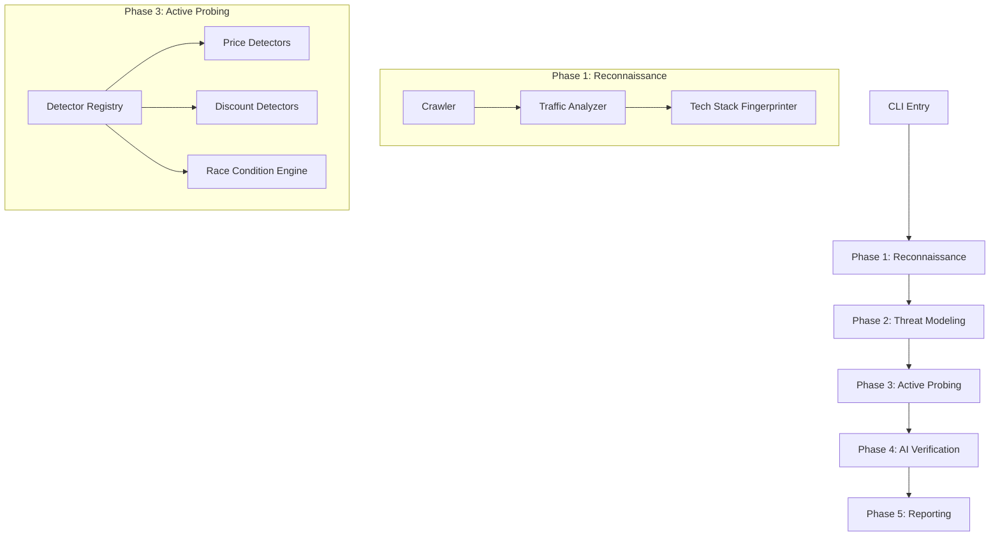

# EcomSecure Scanner

<div align="center">


**AI-Powered Security Scanner for E-Commerce Platforms**

[Features](#features) • [Architecture](#architecture) • [Installation](#installation) • [Usage](#usage) • [Methodology](#methodology)

</div>

---

## Overview

**EcomSecure Scanner** is a specialized security testing tool designed to identify vulnerabilities unique to e-commerce logic. Unlike generic web scanners, EcomSecure focuses on business logic flaws such as **Price Manipulation**, **Discount Abuse**, **Inventory Race Conditions**, and **Payment Bypasses**.

Built with a modular architecture and enhanced by Large Language Models (LLMs), it drastically reduces false positives by understanding the *context* of a vulnerability, not just the syntax.

## Features

- 🛒 **Business Logic Focused**: detects zero-price exploits, currency overflows, and cart tampering.
- 🤖 **AI Verification**: Integration with Gemini/OpenAI models to validate findings and generate proof-of-concept exploits.
- ⚡ **Race Condition Engine**: Specialized concurrency testing to identify inventory TOCTOU (Time-of-Check to Time-of-Use) bugs.
- 📊 **Multi-Format Reporting**: Generates compliance-ready reports in JSON, HTML, SARIF, and Markdown.
- 🔌 **Platform Agnostic**: Works against Shopify, WooCommerce, Magento, and custom headless implementations.

## Architecture

EcomSecure operates on a 5-phase pipeline designed to mimic a sophisticated attacker's workflow:



## Installation

### Prerequisites

- Node.js >= 20.0.0
- NPM or Yarn

### Setup

```bash
# Clone the repository
git clone https://github.com/bhasinagam/Ecom-Secure.git

# Install dependencies
npm install

# Build the project
npm run build

# Link globally (optional)
npm link
```

### Configuration

Create a `.env` file in the root directory:

```env
# Required for AI Verification
OPENROUTER_API_KEY=your_key_here
LLM_MODEL=google/gemini-2.0-flash-exp:free

# Optional Rate Limiting
RATE_LIMIT_RPS=10
SCAN_TIMEOUT=30000
```

## Usage

### Basic Scan

Run a standard scan against a target store:

```bash
ecomsecure scan https://vulnerable-store.com
```

### Advanced Options

```bash
# Scan only for price manipulation and discount abuse
ecomsecure scan https://target.com --modules price,discount

# Generate a SARIF report for GitHub Security integration
ecomsecure scan https://target.com --format sarif --output ./results

# Run in CI/CD mode (skips interactive prompts)
ecomsecure scan https://target.com --yes --no-ai
```

## Methodology

### 1. Behavior Analysis
The scanner builds a state machine of the checkout flow (Cart -> Shipping -> Payment -> Success). It then attempts to bypass states, for example, jumping directly from "Cart" to "Success" to bypass payment.

### 2. Parameter Fuzzing
We use smarter fuzzing than standard tools. Instead of random strings, EcomSecure injects logic-specific payloads:
- **Price**: Negative integers (`-100`), small floats (`0.01`), and overflows (`99999999`).
- **Quantity**: Array pollution (`qty[]=1`), non-numeric types (`qty=true`).

### 3. AI verification
Upon finding a potential vulnerability, the system packages the HTTP request/response pair and sends it to an LLM agent. The agent analyzes the response to determine if the attack was actually successful (e.g., "Did the order total actually change to $0?"), significantly reducing noise.

## Contributing

We welcome contributions! Please see [CONTRIBUTING.md](CONTRIBUTING.md) for details on how to get started.

## License

This project is licensed under the MIT License - see the [LICENSE](LICENSE) file for details.

## Disclaimer

⚠️ **For Educational and Authorized Testing Only**

This tool is intended to help secure e-commerce systems. The author (Agam Bhasin) is not responsible for any misuse or damage caused by this program. Always obtain explicit permission before scanning any target.
